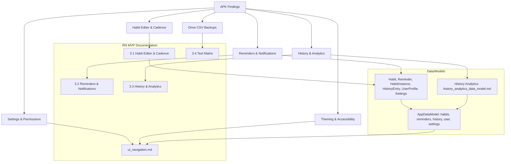

# APK Crosswalk Diagram (Mermaid) - IsmailNow

Date: 2026-03-11
App: HabitNow.apk

Notes
- This light-weight diagram provides a quick crosswalk view; you can embed this in your docs viewer to visualize how APK signals map to RN MVP artifacts.
- You can extend with more detailed mappings as you add migration notes, security, and i18n docs.
